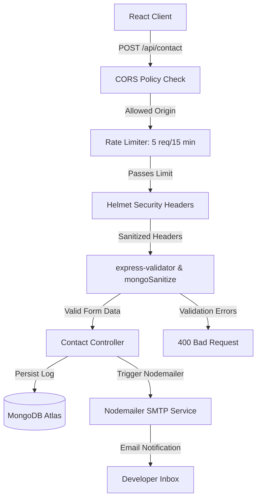

# Full-Stack Developer Portfolio | Rohit Sinha

[](https://react.dev/)
[](https://vite.dev/)
[](https://nodejs.org/)
[](https://expressjs.com/)
[](https://www.mongodb.com/)
[](https://nodemailer.com/)
[](https://vercel.com/)
[](https://railway.app/)

A modern, production-grade full-stack developer portfolio. This project features a highly responsive React frontend designed with bespoke vanilla CSS variables (design tokens), structured layout rails, and a dynamic project grid, paired with a secure, robust Node.js/Express API contact gateway.

* **Live Demo:** [client-two-rust-90.vercel.app](https://client-two-rust-90.vercel.app/)
* **Frontend Deployment:** Vercel
* **Backend API Deployment:** Railway

---

## Architecture & Request Flow

The backend functions as a secure gateway for contact and message routing, verifying incoming submissions through multiple middleware security layers before persisting them in MongoDB and notifying the developer via SMTP.



---

##  Key Features

### Frontend (Client)
* **Modular React Elements:** Built with high-performance React (v19) and Vite (v8) for near-instantaneous hot-module reloading and optimized production bundles.
* **Custom Responsive CSS Grid:** Avoids bulky frameworks in favor of clean, highly optimized Vanilla CSS (Flexbox/Grid) styled with dynamic design tokens.
* **Semantic HTML5 & Accessibility:** Fully accessible elements containing descriptive ARIA roles and labels for screen readers.
* **Dynamic Experience & Project Catalog:** Fully data-driven components that render structured history rails and custom cards dynamically.

###  Secure Backend API (Server)
* **Helmet Middleware:** Configures secure HTTP response headers to block common vulnerabilities (Strict-Transport-Security, clickjacking, MIME-sniffing, and Cross-Site Scripting).
* **NoSQL Injection Filter:** Uses `express-mongo-sanitize` to scrub request bodies and parameters of keys containing Mongo operators (`$` or `.`) to prevent injection bypasses.
* **Input HTML Escaping:** Integrates `express-validator` rules to escape raw HTML tags (e.g. `<script>`), preventing stored Cross-Site Scripting (XSS).
* **Rate Limiting Middleware:** Implements `express-rate-limit` on the message submission route to limit incoming calls to 5 requests per 15-minute window per IP, blocking spam and brute-force flooding.
* **Dynamic CORS Policy:** Protects API endpoints by configuring Cross-Origin Resource Sharing (CORS) to exclusively accept requests from authorized client origins.
* **Database Logger & Mailer:** Stores validated submissions in MongoDB Atlas using Mongoose schemas and forwards dynamic plain-text/HTML notification templates via Nodemailer.

---

## Repository Structure

The project is structured as a monorepo consisting of the client (frontend) and server (backend) codebases:

```text
portfolio/
├── client/                 # React Frontend
│   ├── public/             # Static Assets
│   ├── src/
│   │   ├── components/     # Nav, Hero, Stack, Experience, Projects, Contact
│   │   ├── data/           # Structured projects & experience arrays
│   │   ├── styles/         # Global resets, variable design tokens, utility CSS
│   │   ├── App.jsx         # App component setup
│   │   └── main.jsx        # App entry point
│   ├── vite.config.js      # Vite build configuration
│   └── package.json
│
├── server/                 # Express API
│   ├── server.js           # Server runner (DB connection, port binding)
│   ├── src/
│   │   ├── app.js          # Express app wrapper (middleware setup, base routing)
│   │   ├── config/         # Database configurations
│   │   ├── controllers/    # Contact form controllers
│   │   ├── middleware/     # Rate limits, sanitizers, validation checkers
│   │   ├── models/         # MongoDB schemas (Mongoose models)
│   │   ├── routes/         # Express Router mounts
│   │   ├── utils/          # Nodemailer SMTP email transporters
│   │   └── validation/     # Schema field validator rules
│   └── package.json
```

---

## Environment Configuration

Before running the application, configure your environments.

### Server Env Configuration
Create a `.env` file in the `server/` directory and supply the following variables:

```env
PORT=8000
MONGO_URI=mongodb+srv://<username>:<password>@<cluster>.mongodb.net/<database>

# SMTP Transporter Config (e.g., Gmail SMTP)
SMTP_HOST=smtp.gmail.com
SMTP_PORT=587
SMTP_SECURE=false
SMTP_USER=your-email@gmail.com
SMTP_PASS=your-app-specific-password

# Contact Routing Recipient
CONTACT_EMAIL=recipient-email@gmail.com

# Client URL (for CORS allowance)
CLIENT_URL=http://localhost:5173
```

---

## Running Locally

### Prerequisites
* [Node.js](https://nodejs.org/) (v18.x or v20.x recommended)
* [MongoDB](https://www.mongodb.com/try/download/community) locally installed or a MongoDB Atlas account

### 1. Setup the Server
```bash
cd server
npm install
# Start in development mode (with nodemon hot-reload)
npm run dev
```

### 2. Setup the Client
```bash
cd client
npm install
# Launch development server
npm run dev
```
Open your browser and navigate to `http://localhost:5173`.

---

## API Reference

### Contact Form Submission
* **Endpoint:** `/api/contact`
* **Method:** `POST`
* **Content-Type:** `application/json`
* **Rate Limit:** 5 requests per 15 minutes per IP address.
---

##  Showcase Portfolio Catalog

This portfolio highlights several prominent full-stack and backend systems built by the developer:

1. **[SwiftCart](https://github.com/RohitGkmit08/SwiftCart)** — Premium full-stack e-commerce web application featuring Node.js/Express backend API, MongoDB database, Razorpay payment gateway integration, Cloudinary media storage, OTP email verification, and Redux Toolkit state management.
2. **[Ledger System](https://github.com/RohitGkmit08/Ledger)** — High-integrity double-entry bookkeeping system with atomic MongoDB database transactions, posted immutable entries, Gmail OAuth2 notification updates, and duplicate-retry safeguards.
3. **[Jira Task Manager](https://github.com/RohitGkmit08/jira-admin-app)** — Multi-project task management dashboard featuring standard Kanban board structures with drag-and-drop actions, client-side state machine configurations, and custom project-level Role-Based Access Controls (RBAC).
4. **[Notes API](https://github.com/RohitGkmit08/notes-api)** — Production-grade multi-user notes REST API featuring JWT authentication, secure tag filtering, note sharing, and interactive OpenAPI documentation.
5. **[Full-Stack Blog App](https://github.com/RohitGkmit08/blog-app-frontend)** — Complete CMS-style blogging framework with custom admin dashboard controls, article state machine moderations, and automatically dispatched SMTP state-transition alerts.

---

##  Connect

* **LinkedIn:** [/in/rohit-sinha-ba7298238](https://linkedin.com/in/rohit-sinha-ba7298238/)
* **LeetCode Profile:** [/sinharohit01](https://leetcode.com/sinharohit01)
* **Email:** [sinharohit96690@gmail.com](mailto:sinharohit96690@gmail.com)
